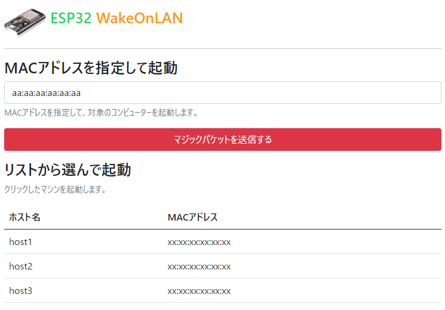

# esp32wol

ESP32でWakeOnLanするサンプルです。ブラウザから遠隔地にあるPCをリモート起動できます。

## つかいかた

http://[ESP32のIPアドレス]/wolにアクセスすると、マジックパケット送信ページが表示されます。



MACアドレスを入力して送信ボタンを押すと、マジックパケットが送信され、PCをリモート起動することができます。

## カスタマイズ

### MACアドレスリストへの登録

MACアドレスをあらかじめ登録しておくことができます。data/wol.htmlにあるmaclistを編集してください。

```
maclist: [
    //json形式で記載すると、リストに表示されます。
    { name: "host1", mac: "xx:xx:xx:xx:xx:xx" },
    { name: "host2", mac: "xx:xx:xx:xx:xx:xx" },
    { name: "host3", mac: "xx:xx:xx:xx:xx:xx" },

],
```

### 外部からのアクセスを可能にする

ルーターの設定を変更することで、インターネットから家の中のPCなどを起動することができます。

インターネット側の任意のポートをESP32へ開放（フォワーディング）するようにしてください。

WebサーバーにはESPAsyncWebServerを使用していますので、BASIC認証などの実装も可能です。詳しくは[ESPAsyncWebServerのドキュメント](https://github.com/me-no-dev/ESPAsyncWebServer)を確認してください。

## 仕様

### 開発環境

PlatformIO

### ESP32ライブラリ

- WakeOnLan（https://platformio.org/lib/show/6593/WakeOnLan）
- ESPAsyncWebServer（https://platformio.org/lib/show/6758/ESPAsyncWebServer-esphome）

### フロントエンドライブラリ

- Bootstrap5(https://getbootstrap.jp/)
- Vue.js(https://jp.vuejs.org/index.html)

